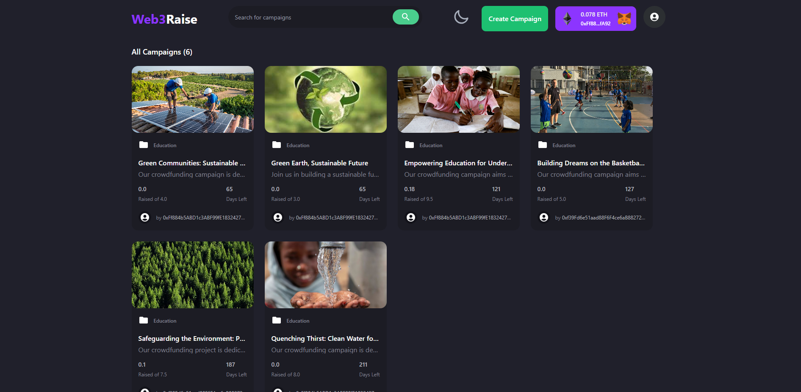

## Web3Raise💚
Web3Raise is a decentralized crowdfunding platform built on top of Ethereum blockchain. It allows users to create and fund campaigns for their projects using smart contracts. With Web3Raise, users can easily raise funds and track the progress of their campaigns in a transparent and secure manner.



## Features
- Create and manage crowdfunding campaigns
- Set fundraising goals and deadlines
- Contribute to campaigns in SepoliaETH
- View campaign details, including contributors and donation amounts
- Real-time tracking of funds raised and progress-bar towards the goal
- Seamless integration with Web3 wallets and Metamask for easy donation transactions

## Technologies Used
- ThirdWeb: A development framework for building decentralized applications on Ethereum.
- React: A JavaScript library for building user interfaces.
- Vite: A fast build tool for modern web applications.
- Hardhat: A development environment for Ethereum smart contracts.
- SOlidity: The most important web3 language for writing smart contracts.
- Sepolia Testnet: A public Ethereum testnet for development and testing purposes.
- Tailwind CSS: A utility-first CSS framework for building responsive and modern user interfaces.

## Future Enhancements
- Toggle Dark/Light Theme: I am working on adding the ability for users to switch between a dark and light theme. This will provide a personalized visual experience and enhance usability based on individual preferences.

- Search Bar and Campaign Categories: I am actively developing a search functionality that will allow users to easily find specific campaigns based on keywords or categories. Additionally, I will introduce a categorization system for campaigns, enabling users to browse campaigns based on their interests or preferred causes.

I am committed to continuously improving Web3Raise and providing a seamless crowdfunding experience. Stay tuned for these exciting updates!

## Getting Started

Create a project using this example:

```bash
npx thirdweb create --template vite-javascript-starter
```

You can start editing the page by modifying `src/main.jsx`. The page auto-updates as you edit the file.

On `src/index.jsx`, you'll find our `ThirdwebProvider` wrapping your app,
this is necessary for our [hooks](https://portal.thirdweb.com/react) and
[UI Components](https://portal.thirdweb.com/ui-components) to work.

### Deploy to IPFS

Deploy a copy of your application to IPFS using the following command:

```bash
yarn deploy
```

## Learn More

To learn more about thirdweb, Vite and React, take a look at the following resources:

- [thirdweb React Documentation](https://docs.thirdweb.com/react) - learn about our React SDK.
- [thirdweb JavaScript Documentation](https://docs.thirdweb.com/react) - learn about our JavaScript/TypeScript SDK.
- [thirdweb Portal](https://docs.thirdweb.com/react) - check our guides and development resources.
- [Vite Documentation](https://vitejs.dev/guide/) - learn about Vite features.
- [React documentation](https://reactjs.org/) - learn React.

You can check out [the thirdweb GitHub organization](https://github.com/thirdweb-dev) - your feedback and contributions are welcome!

## Join our Discord!

For any questions, suggestions, join our discord at [https://discord.gg/thirdweb](https://discord.gg/thirdweb).
